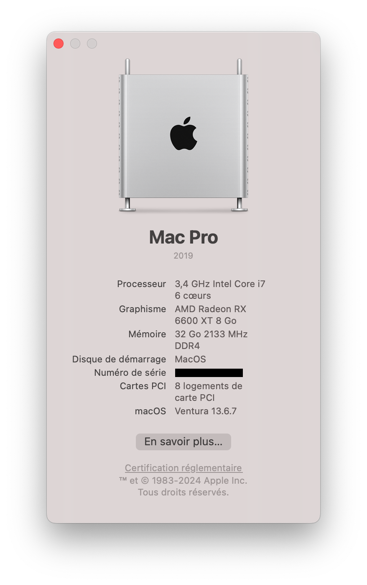

# OpenCore - X99 - i7 Gen 6th - i7-6800k

## 1 - Small description

The aim of this project was to test OpenCore with a recent version of macOS, with a future Apple application specialization.

## 2 - The hardware configuration

- Power supply: **Corsair RM 1000W**
- Motherboard: **GA-X99-UD4**
	- BIOS: **F23**
- CPU: **Intel Core i7 6800K @ 3,40Ghz 6 Cores (12 Threads)**
    - Architecture: **Broadwell E, 2011-3**
- RAM: **32 Go - 8x 8Go 3200Mhz DDR4**
- GPU: **AMD Readeon RX 6600 XT 8Go**
- Network:
	- Ethernet: **Intel® GbE LAN chips (10/100/1000 Mbit)**
   - Wifi & BT: **Intel® Dual Band Wireless-AC 7265 (b/a/g/n/ac/BT 4.2)**
        - Ref: **Intel 7265.NGWG.W**
        - Wifi protocols: **IEEE 802.11b (Wifi 1)**, **IEEE 802.11a (Wifi 2)**, **IEEE 802.11g (Wifi 3)**, **IEEE 802.11n (Wifi 4)**, **IEEE 802.11ac (Wifi 5)**
        - Bluetooth protocols: **Bluetooth 4.2**
        - Interface: **M.2**
- Storage disk: SSD Crucial BX500 SATA 6 Gb/s 2.5"
    - Read: **540** Mo/s
    - Write: **500** Mo/s
- Screens:
    - Screen 1: **DELL P2310H 28"**
        - Size: **28"**
        - Resolution: **3840x2160**
        - Refresh rate: **60Hz**
        - Interface: **DisplayPort**
        - Disposition: **Payage**
    - Screen 2: **DELL P2310H 23"**
        - Size: **23"**
        - Resolution: **1920x1080**
        - Refresh rate: **30Hz**
        - Interface: **HDMI**
        - Disposition: **Portrait**
    - Screen 3: **DELL P2311H 23"
        - Size: **23"**
        - Resolution: **1920x1080**
        - Refresh rate: **30Hz**
        - Interface: **HDMI**
        - Disposition: **Portrait**

## 3 - The OpenCore configuration

### 3.1 - Targeted tests

- Computer: **Mac Pro - MacPro7,1** 
- OS version: **Sonoma (14.5)**

### 3.2 - Résults

#### 3.2.1 - OS tested

- Ventura :
	- OpenCore : 1.0.0
	- OS : Ventura (13.6.7)
	- Result : ✅ Good
- Sonoma :
	- OpenCore : 1.0.0
	- OS : Sonoma (14.5)
	- Result : ❌ : 
		- **[Blocked]** AppleSMC => Auto reboot - [like here](https://i.redd.it/k4yhdjrwzzcd1.jpeg)

#### 3.2.2 - Test times

- First tests: 2024-06-11
- Last tests: 2024-06-14
- Test duration of this version: current (last: 2024-09-10)

#### 3.2.3 - Features tested in Ventura

For more information : [All screenshots](DOCS/0_All_Screenshots.md)

- Bootloader:
    - OpenCore: ✅
- USB installation key:
    - Starting the installer: ✅
    - Start installation: ✅
    - Finalize installation: ✅
- In OS:
    - PC components
        - Interface elements: ✅
        - Screens: ✅
            - Screen 1: 🔄 (but not in 60Hz)
            - Screen 2: ✅
            - Screen 3: ✅
        - USB ports: ✅
        - Sound: ✅
        - Microphone: ✅
        - Webcam: ✅
        - Ethernet: ✅
        - WIFI: ❌
        - Bluetooth: ❌
    - OS components
        - All native apps: ✅
        - iCloud: ✅
        - Collaborate: ✅
        - App Store: ✅
        - System Preferences: ✅
            - Stability :🔄
        - System updates: 🤷‍♂️

### 4 - Feadback

Overall, the OS runs like clockwork. However, I do experience some slowdowns. 

I think this is directly due to the load on the processor, RAM and storage, which are now very low compared with the latest technologies.

On the storage side, SSDs show their weaknesses, with very low read/write speeds compared with those used on hardware designed for this OS.
As far as RAM is concerned, I found that the OS was used extensively without any applications open. Then, when combining applications such as Google Chrome, Teams and Visual Studio Code, RAM quickly reached a significant level, bordering on saturation.
As for the CPU, I didn't experience too many negative points, apart from its slow ageing, which I felt was due to its robustness.

However, I'm thinking of giving it another try later with a more recent configuration (for example: Intel i7 12th gen + 64GB RAM + 1TB SSD M.2).

### 5 - If you want to test

The project is viable and you simply need to copy and paste the EFI folder for a similar configuration.

### 6 - Main sources

- To prepare OpenCore for my configuration :
	- [https://www.reddit.com/r/hackintosh/comments/17mlgzn/huananzhi_x99_bd4_intel_xeon_e52670_v3_amd_radeon/](https://www.reddit.com/r/hackintosh/comments/17mlgzn/huananzhi_x99_bd4_intel_xeon_e52670_v3_amd_radeon/)
- To disable auto-restart when controlling AppleSMC.: 
	- [https://www.reddit.com/r/hackintosh/comments/1e584hg/system_shutting_down_when_opening_macos_installer/](https://www.reddit.com/r/hackintosh/comments/1e584hg/system_shutting_down_when_opening_macos_installer/)

### 7 - Thanks

Thank you for taking the time to discover my test.